# Computer Science 112 via Study.com - Assignment 1: Writing an Employee Management System

## Required Tooling

> The project expects a Linux environment, tested in Ubuntu 24.04.3 LTS via WSL and Arch.

### CMake
- *CMake is the de-facto standard for building C++ code.* - [CMake.org](https://cmake.org/)
- Tested with version 4.2.1

### GCC
- *The GNU Compiler Collection includes front ends for C, C++, Objective-C, Fortran, Ada, Go, D, Modula-2, and COBOL as well as libraries for these languages (libstdc++,...).* - [gcc.gnu.org](https://gcc.gnu.org/)
- Tested with version 15.2

## Build Instructions

> Build and run automatically.
1. Clone the repository.
1. Run the build script: `./run.sh`

> Build and run manually. 
1. Clone the repository.
1. Create a build directory: `cmake -B build`
1. Build the project: `cmake --build build`
1. Run the application: `./build/bin/assignment1`

## Output

Follow on screen prompts to demonstrate functionality.

## Screenshots

||||
|:-:|:-:|:-:|
|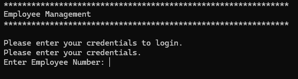|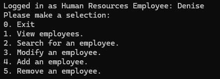||
|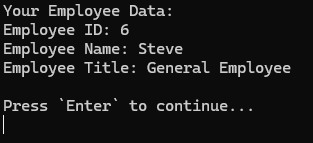||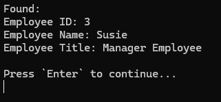|
|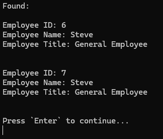|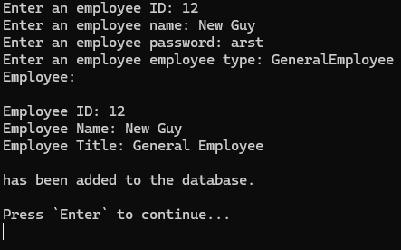|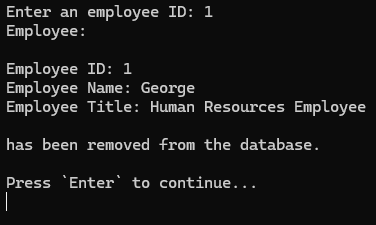|
|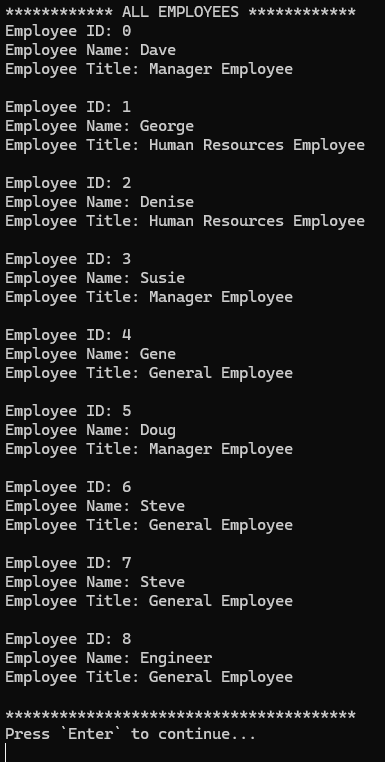|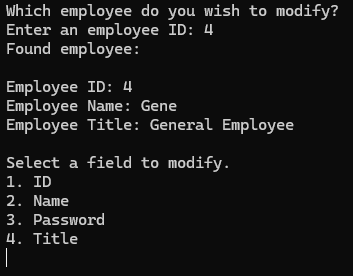|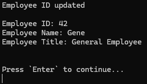|
|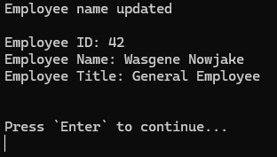|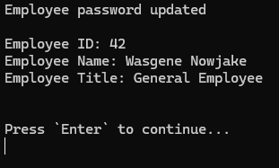|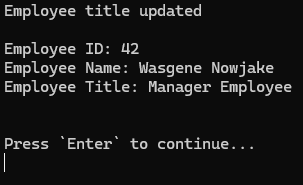|

